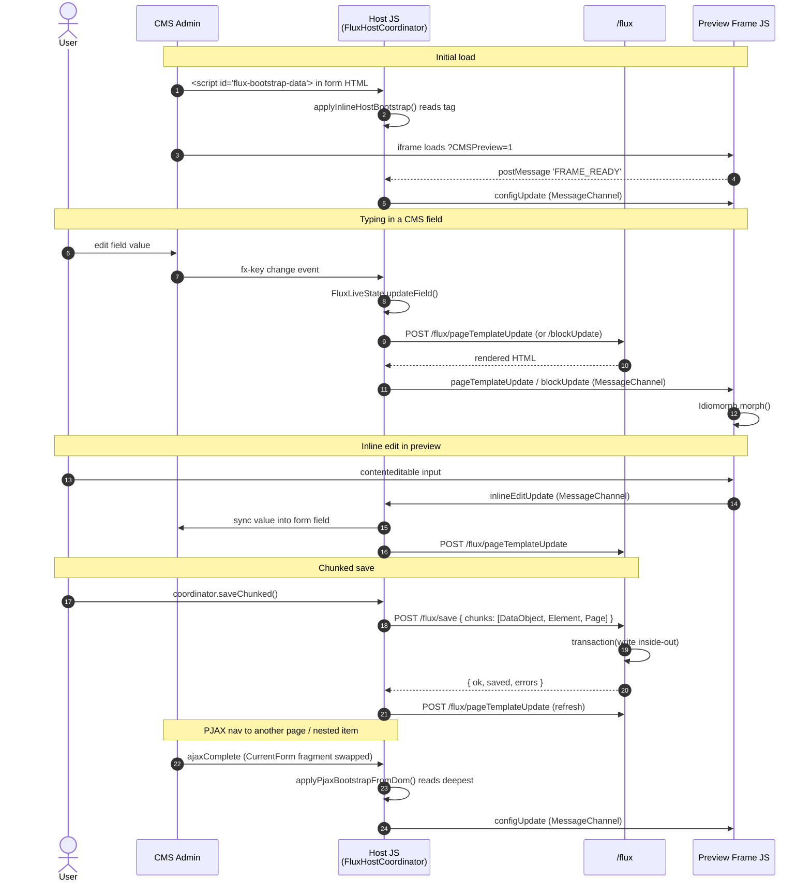

# Architecture

Flux is two cooperating runtimes connected by a `MessageChannel`:

- **Host** — runs inside the Silverstripe admin (`LeftAndMain`). Owns the form, the ChangeSet, and the chunked save.
- **Frame** — runs inside the CMS preview iframe (a normal frontend render with `?CMSPreview=1`). Owns the morph + inline editing UI.

Both sides share a single source of truth: `FluxContext`, derived from `flux_fields` / `flux_relation_fields` config (typically generated by `sake flux:generate-config`).

## How context reaches each side

| Side | Source | When |
|---|---|---|
| Host (full load + PJAX) | `<script id="flux-bootstrap-data" type="application/json">` pushed into the form HTML by `FluxLeftAndMainExtension::updateEditForm` (page form) or `FluxGridDetailFormExtension::updateItemEditForm` (nested item form) | Initial page render + every PJAX nav — the script tag rides inside whatever form fragment the CMS swaps in |
| Frame | `configUpdate` MessageChannel message | Whenever the host signals the iframe is ready and on every CMS nav |

**The CMS host is the single source of truth.** The frame deliberately does *not* fetch `/flux/context` on its own — it would race the host's broadcast and overwrite block / relation-item scopes with page-scoped data. The endpoint still exists for debugging and external callers.

When two `flux-bootstrap-data` tags are present (initial full-page load of a nested URL — both extensions fire), the deeper one in DOM order wins, since the item-form tag is rendered inside the page-form tag.

`FluxContextResolver` has two entry points:

- `forLeftAndMain($admin)` — used by the page-form extension; resolves whatever the LeftAndMain `currentRecord()` returns.
- `forGridFieldItem($item, $parent, $relationName)` — used by the GridFieldDetailForm extension; gets the item, parent record, and relation name handed in by the framework hook. No URL parsing.

## Endpoints (`/flux`)

| Verb | Path | Purpose |
|---|---|---|
| `GET` | `/flux/context` | Schema + scope for the preview frame |
| `POST` | `/flux/save` | Chunked save (DataObject → Element → Page, single transaction) |
| `POST` | `/flux/pageTemplateUpdate` | Render full page with an in-memory ChangeSet |
| `POST` | `/flux/blockUpdate` | Render a single element with an in-memory ChangeSet |
| `POST` | `/flux/shortCodesFragmentPatch` | Parse shortcodes for inline preview |

Mutating actions require admin permission **and** a Silverstripe `SecurityToken` (sent as `X-SecurityID`).

## Event flow



## Scope

`FluxContext.scope` is one of:

- `page` — every `fx-*` element is editable
- `block` — only elements whose nearest `fx-owner` matches `scope.ownerId`
- `relation-item` — same, scoped to a GridField item's owner

Enforced by `FluxScopeGuard` inside `InlineEditor`. Out-of-scope elements get `fx-out-of-scope` and skip binding.

## Extending the context

Modules can contribute dynamic, per-record data that doesn't fit in static YAML by adding an extension on a Page with an `updateFluxContext` hook:

```php
public function updateFluxContext(FluxContext $context): void
{
    $context->addRelationField(get_class($this->getOwner()), 'Fields', [
        'selector' => '.userform-fields .field',
        'actions'  => ['edit', 'delete'],
        'idMap'    => $idMap,
        'Fields'   => ['Title' => ['bind' => '.left', 'type' => 'Text']],
    ]);
}
```

`FluxUserFormsExtension` is the reference implementation.
